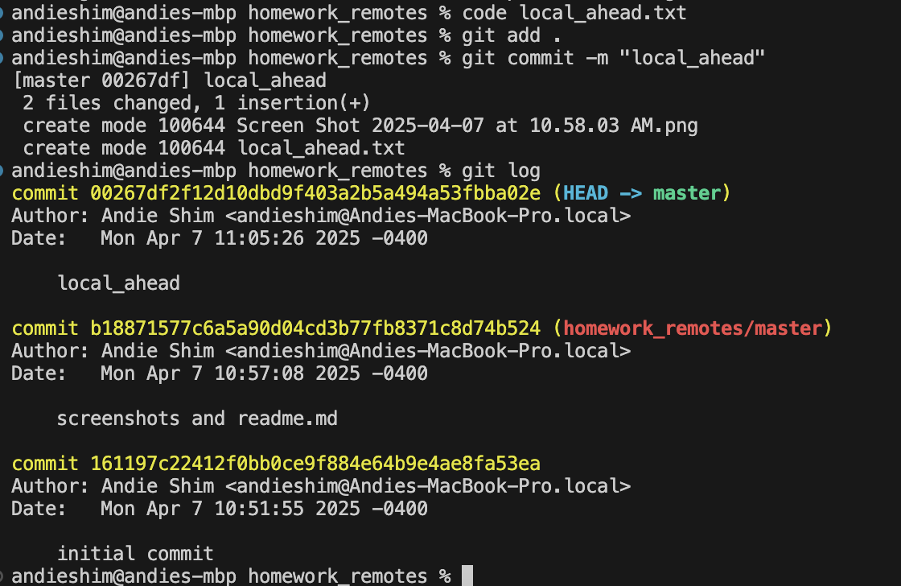
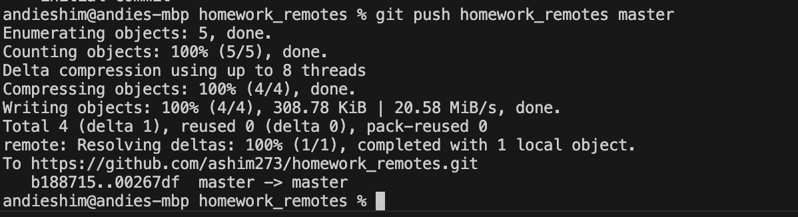
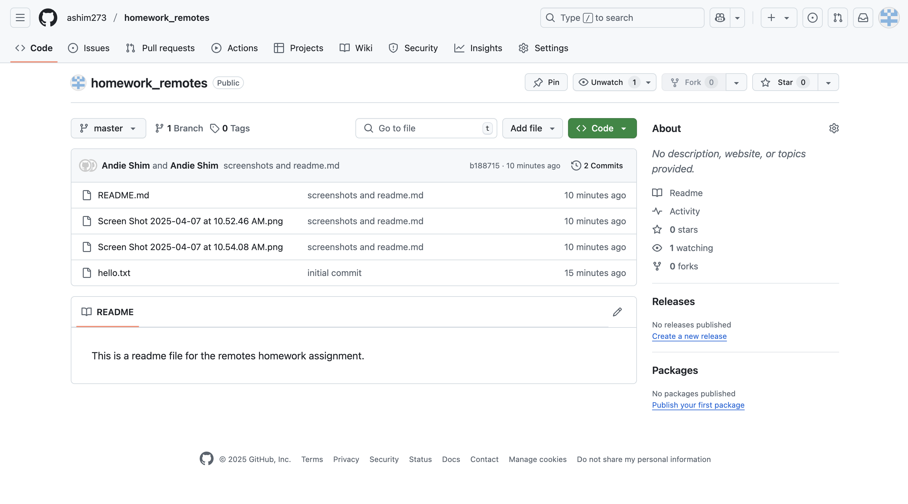
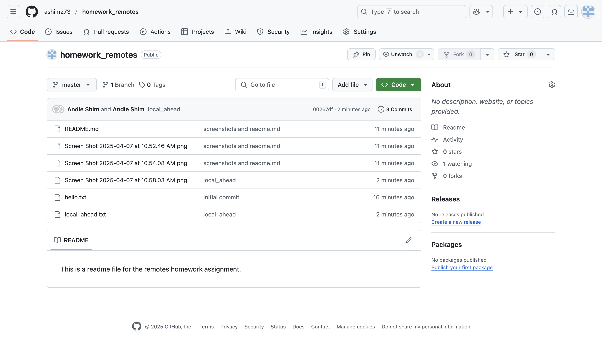
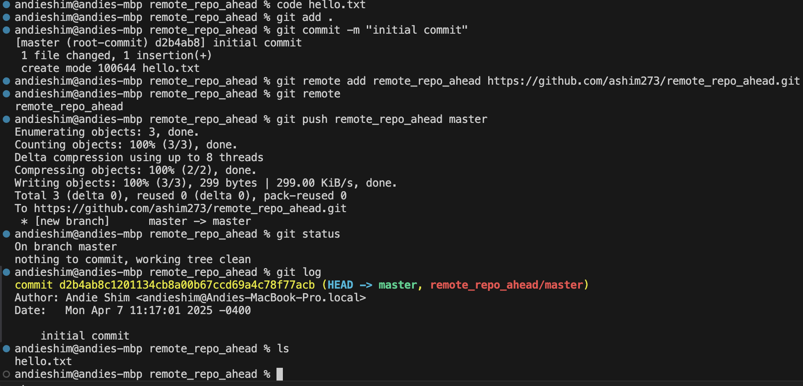
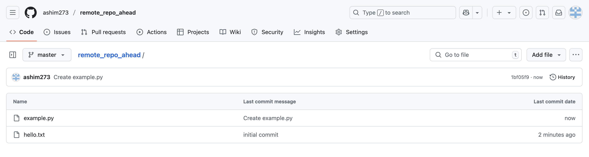
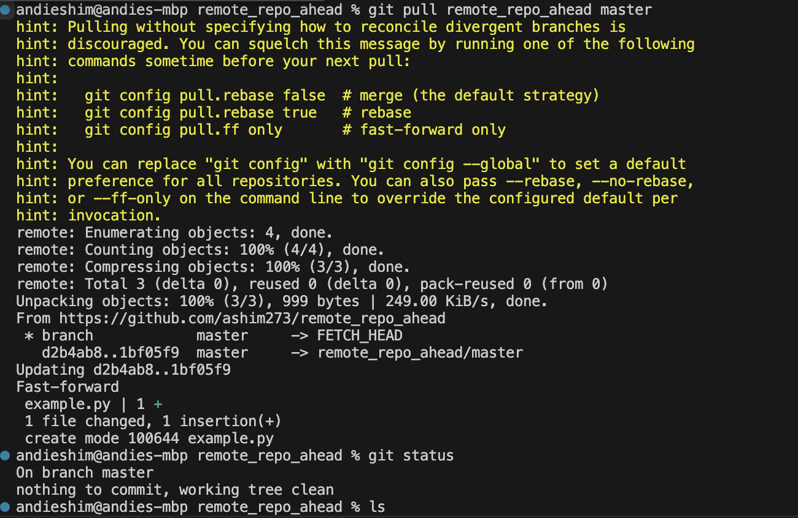

**This is what my local repo looks like after I created the remote but before I pushed the information to the remote repo.**
**The second photo is the code I used to push the new code.**

**This is what my remote repo looks like before and after I pushed.**

**This is what my local and remote repos looked like before I pulled down information. I know they are at different points because they have a different number of files.**

**This is what my local repo looks like after I pulled the information down from the remote repo.**
